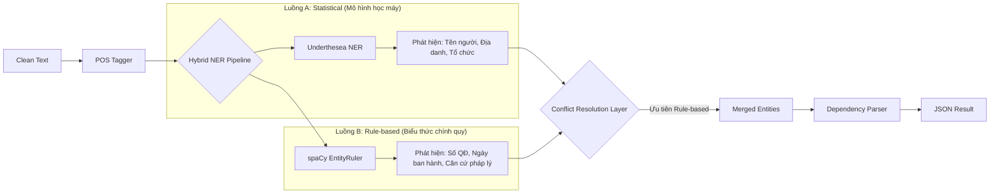

# Module 2: NLP Analysis (Phân tích Ngôn ngữ Tự nhiên)

Module này đóng vai trò "bộ não ngôn ngữ" của hệ thống, thực hiện các tác vụ phân tích cú pháp và ngữ nghĩa để trích xuất các đặc trưng quan trọng từ văn bản trước khi đưa vào LLM.

## 🎯 Mục tiêu
1.  **Nhận dạng thực thể (NER)**: Xác định chính xác các thông tin quan trọng như Số hiệu văn bản, Ngày tháng, Tên cơ quan, Người ký.
2.  **Phân tích cú pháp (Dependency Parsing)**: Hiểu cấu trúc câu (Chủ-Vị) để hỗ trợ việc trích xuất thông tin phức tạp (nếu cần mở rộng sau này).
3.  **Gán nhãn từ loại (POS Tagging)**: Phân loại từ (Danh từ, Động từ...) để lọc nhiễu.

## 🛠 Công nghệ & Thư viện

| Thư viện | Model / Công cụ | Mục đích |
| :--- | :--- | :--- |
| **spaCy** | `vi_core_news_lg` | Framework NLP chính. Model lớn hỗ trợ tiếng Việt tốt nhất hiện nay. |
| **Underthesea** | `ner` | Thư viện NLP chuyên biệt cho tiếng Việt, dùng để đối chiếu kết quả NER. |
| **spaCy EntityRuler** | Rule-based | Tạo các luật (rules) tùy chỉnh để bắt các mẫu văn bản hành chính đặc thù. |

## ⚙️ Kiến trúc Hybrid NER (Lai ghép)

Hệ thống sử dụng kiến trúc lai (Hybrid) để tận dụng ưu điểm của cả hai phương pháp: **Thống kê (Statistical)** và **Luật (Rule-based)**.



### Chiến lược giải quyết xung đột (Conflict Resolution)
Khi cả hai luồng cùng phát hiện thực thể tại một vị trí nhưng khác nhãn, hệ thống áp dụng chiến lược **"Rules-First"**:
*   Tin tưởng các luật cứng (Regex) hơn là dự đoán của mô hình thống kê đối với các trường có cấu trúc rõ ràng (như Số quyết định, Ngày tháng).
*   Dùng mô hình thống kê cho các trường biến thiên cao (như Tên người, Tên tổ chức lạ).

## 💡 Chi tiết kỹ thuật

### 1. Định nghĩa Thực thể (Entities)
Các nhãn thực thể được định nghĩa trong `rules.py`:

| Nhãn (Label) | Ý nghĩa | Ví dụ Pattern |
| :--- | :--- | :--- |
| `DECISION_ID` | Số hiệu quyết định | `\d+/[A-ZĐƯ-]+` (VD: 123/QĐ-BGDĐT) |
| `ISSUE_DATE` | Ngày ban hành | `ngày \d{1,2} tháng \d{1,2} năm \d{4}` |
| `CIRCULAR_REF` | Thông tư căn cứ | `Thông tư số \d+` |
| `DECREE_REF` | Nghị định căn cứ | `Nghị định số \d+` |

### 2. Fallback Mechanism (Cơ chế dự phòng)
Do model `vi_core_news_lg` khá nặng và đôi khi khó cài đặt:
*   Hệ thống tự động kiểm tra xem model có tồn tại không.
*   Nếu không tìm thấy, nó sẽ chuyển sang dùng `xx_ent_wiki_sm` (model đa ngôn ngữ nhẹ hơn) hoặc chỉ chạy Rule-based NER.
*   **Lưu ý**: Khi chạy fallback, tính năng Dependency Parsing sẽ bị tắt để tránh lỗi.

## ⚠️ Hướng dẫn cài đặt Model
Để Module 2 hoạt động tối ưu nhất, hãy cài đặt model tiếng Việt lớn:

```bash
# Cách 1: Qua pip (nếu link còn hoạt động)
pip install https://github.com/dungba88/spacy_vi/releases/download/v3.0.0/vi_core_news_lg-3.0.0.tar.gz

# Cách 2: Tải thủ công
# 1. Tải file .tar.gz về máy
# 2. pip install /path/to/file.tar.gz
```
